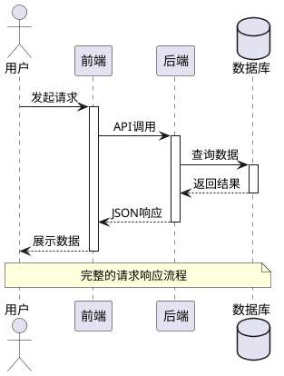
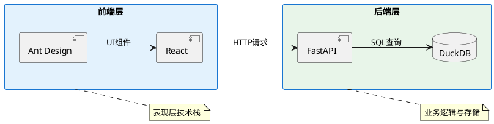
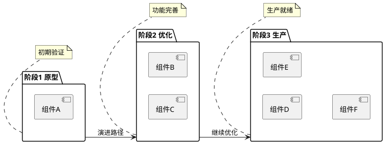

截至 **2025年11月**，PlantUML 的最新稳定版本为 **v1.2024.10**（发布于 2024年10月），其语法规范在保持向后兼容的基础上，持续增强表达力、可读性与工具集成能力。以下是 **最新 PlantUML 语法规范的核心要点总结**（涵盖截至 2025 年的主要更新与稳定特性）：

---
示例prompt：分析项目架构，生成HTML的架构优缺点报告。html中使用PlantUML插图描述。严格按照PlantUML语法进行编写
---

## ⚠️ 浏览器渲染快速避坑指南（必读）

> **适用场景**：使用 PlantUML Server（在线/本地）进行浏览器端渲染时

| 问题类型 | ❌ 错误写法 | ✅ 正确写法 |
|---------|------------|------------|
| **主题加载失败** | `!theme material` | 移除主题，用 `skinparam` |
| **文本换行** | `消息文本
换行` | 单行文本，或用 `note` |
| **activate位置** | `A -> B activate B` | 分两行：`A -> B` 然后 `activate B` |
| **标题换行** | `"标题
副标题"` | `"标题 副标题"` |
| **特殊字符** | `component "A + B"` | `component "A B"` |
| **注释格式** | `• 列表项` | 纯文本，移除 `•` |
| **路径参数** | `/api/{id}` | `/api/id` 或 `/api/:id` |
| **skinparam** | `skinparam X {` 缺少 `}` | 确保块闭合 |

**核心原则**：
1. ✅ 使用最简单、最稳定的语法
2. ✅ 避免高级特性（主题、复杂样式）
3. ✅ 文本内容简化，避免特殊符号
4. ✅ 本地先用在线编辑器验证：http://www.plantuml.com/plantuml

**详细说明**：见本文档 [8.8 浏览器渲染常见语法错误](#88-浏览器渲染常见语法错误与修复指南-)

---

### 📌 一、通用语法基础（持续有效）

| 类别 | 说明 |
|------|------|
| **注释** | `''` 单行，`/' ... '/` 多行（注意：`/* */` 不再推荐，可能冲突） |
| **标点** | 分号 `;` 可选（多数图中可省略） |
| **关键字大小写** | 多数关键字不区分大小写（如 `actor`, `Actor` 等效），但建议小写保持风格统一 |
| **转义与特殊字符** | 支持 `\n`, `\t`, `\\`, `\{`, `\}`；支持 Unicode（如 `«interface»`） |
| **皮肤参数（Skinparam）** | 全局样式控制，支持作用域（如 `skinparam sequence { ... }`） |

---

### 📊 二、各类图的最新语法增强（v1.2023~v1.2024）

#### 1. **类图（Class Diagram）**
- ✅ **泛型支持增强**  
  ```plantuml
  class List<T> {
    +add(T item)
    +get(int index): T
  }
  class Map<K, V>
  List<String> --> Map<String, Integer>
  ```
- ✅ **内联注解（Annotation）**  
  ```plantuml
  @Entity
  class User {
    @Id
    +id: Long
  }
  ```
- ✅ **组合/聚合箭头新写法**（语义更清晰）  
  ```plantuml
  A *-- B   ' 组合（实心菱形）
  C o-- D   ' 聚合（空心菱形）
  ```

#### 2. **时序图（Sequence Diagram）**
- ✅ **异步消息（虚线箭头）默认行为优化**  
  ```plantuml
  A ->> B: sync call
  A -// B: async fire-and-forget
  ```
- ✅ **新关键词 `hnote` / `rnote`**（水平/右侧备注）  
  ```plantuml
  hnote over A: This is a horizontal note
  rnote right of B: Right-aligned note
  ```
- ✅ **生命线激活/停用更灵活**  
  ```plantuml
  activate A #FFBBBB
  A -> B
  deactivate A
  ```

#### 3. **用例图（Use Case Diagram）**
- ✅ 支持 `<<include>>` / `<<extend>>` 关系直接标注  
  ```plantuml
  (Login) .> (Authenticate) : <<include>>
  (Register) .> (Login) : <<extend>>
  ```

#### 4. **组件图 & 部署图**
- ✅ **容器嵌套语法标准化**（类似 C4 模型支持）  
  ```plantuml
  @startuml
  rectangle "System" {
    [Web App] --> [Database]
    node "Cloud" {
      [API Gateway]
    }
  }
  @enduml
  ```

#### 5. **状态图（State Diagram）**
- ✅ **并发区域（Fork/Join）支持**  
  ```plantuml
  state "Process" as P {
    [*] --> A
    A --> B
    --
    [*] --> C
    C --> D
    --
    B & D --> [*]
  }
  ```

#### 6. **JSON / YAML 数据图（实验性 → 稳定）**
- ✅ `@startjson` / `@startyaml` 支持高亮与折叠  
  ```plantuml
  @startjson
  {
    "name": "Alice",
    "roles": ["admin", "user"]
  }
  @endjson
  ```

---

### 🎨 三、样式与主题系统（重大更新）

#### 🔹 **新主题引擎（2024 起默认启用）**
- 内置主题：`plain`, `aws-orange`, `cerulean`, `hacker`, `material`, `vibrant`, `bluegray`
  ```plantuml
  @startuml
  !theme cerulean
  actor User
  User --> (Login)
  @enduml
  ```
- 支持自定义主题 `.puml` 文件（通过 `!include`）

#### 🔹 **CSS-like 样式块（实验性 → 推荐）**
```plantuml
<style>
  .critical {
    BackgroundColor lightcoral
    FontColor white
    FontWeight bold
  }
</style>

class "Critical Service" <<critical>>
```

---

### 🧩 四、高级功能与扩展

| 功能 | 说明 |
|------|------|
| **预处理器增强** | 支持 `!if`, `!else`, `!endif`, `!define`, `!include`, `!function`；新增 `!procedure` 宏 |
| **宏与函数** | 可定义复用逻辑（支持参数与返回值） |
| **StdLib 内置库** | 如 `<color>`, `<style>`, `<aws>`, `<kubernetes>` 等（通过 `!include <lib>` 引入） |
| **C4-Model 官方支持** | 通过 `!include <C4/C4_Container>` 等直接使用 C4 元素 |
| **Markdown 混合渲染**（via `@startmd`） | 在注释或笔记中嵌入 Markdown 片段 |

---

### 🔌 五、工具与集成更新

- ✅ **VS Code / IntelliJ 插件**：实时预览、语法高亮、错误提示增强  
- ✅ **PlantUML Server**：支持 `POST /svg`, `POST /png`, `POST /txt`（ASCII 艺术图）  
- ✅ **Accessibility**：生成 SVG 时自动添加 `<title>`, `<desc>` 提升可访问性  
- ✅ **导出增强**：支持 `@enduml(inline)` 内联 SVG base64；`-tsvg:zopfli` 高压缩 SVG

---

### ⚠️ 废弃/变更提醒（2024–2025）

| 旧语法 | 新推荐 | 说明 |
|--------|--------|------|
| `note left of` | `note left` | 简化，`of` 可省略 |
| `skinparam defaultFontName` | `skinparam defaultFont` | 统一命名 |
| `-[#color]->` | `-[#color]->`（无中间短横） | 更简洁，旧式仍兼容 |
| `@startsalt` 移至 StdLib | `!include <salt>` + `@startsalt` | Salt GUI 原型独立为库 |

---

### ✅ 推荐实践（2025）

1. 使用 `!theme` + `<style>` 实现一致视觉
2. 复杂图拆分为多个 `@startuml ... @enduml` 文件，用 `!include` 组合
3. 优先使用语义化箭头：`-->`, `--*`, `--o`, `-down->`
4. 开启 `skinparam wrapWidth 200` 避免长文本溢出
5. 用 `hide empty members` 简化类图

---

## 🎨 八、PlantUML 图表渲染方案

### 8.1 渲染方式对比

| 渲染方式 | 适用场景 | 优势 | 劣势 |
|---------|---------|------|------|
| **本地命令行** | 开发/CI/CD | 无需网络，速度快 | 需要安装Java + PlantUML |
| **PlantUML Server** | Web应用、在线文档 | 无需安装，跨平台 | 依赖服务可用性 |
| **在线服务** | 临时查看、分享 | 即开即用 | 数据隐私风险 |
| **IDE插件** | 日常开发 | 实时预览、自动补全 | 需要IDE支持 |
| **浏览器渲染** | HTML报告、Web应用 | 动态加载、交互性强 | 需要JavaScript |

---

### 8.2 浏览器端渲染方案（推荐）

#### 🔹 技术架构

```
PlantUML 文本
    ↓
1. UTF-8 编码
    ↓
2. Deflate 压缩 (pako.js)
    ↓
3. Base64 编码（PlantUML特殊字符集）
    ↓
4. 构建 URL
    ↓
5. 请求 PlantUML Server
    ↓
6. 返回 SVG/PNG
    ↓
7. 浏览器显示
```

#### 🔹 核心代码实现

**1. 依赖库引入**
```html
<!-- 加载 pako 压缩库 -->
<script src="https://cdn.jsdelivr.net/npm/pako@2.1.0/dist/pako.min.js"></script>
```

**2. Base64 编码函数（PlantUML专用字符集）**
```javascript
const encode64 = (data) => {
    // PlantUML 使用特殊字符集：0-9A-Za-z-_
    const chars = "0123456789ABCDEFGHIJKLMNOPQRSTUVWXYZabcdefghijklmnopqrstuvwxyz-_";
    let res = '';
    let i = 0;
    while (i < data.length) {
        let b1 = data.charCodeAt(i++) & 0xff;
        if (i === data.length) {
            res += chars.charAt(b1 >> 2);
            res += chars.charAt((b1 & 0x3) << 4);
            res += '==';
            break;
        }
        let b2 = data.charCodeAt(i++);
        if (i === data.length) {
            res += chars.charAt(b1 >> 2);
            res += chars.charAt(((b1 & 0x3) << 4) | ((b2 & 0xF0) >> 4));
            res += chars.charAt((b2 & 0xF) << 2);
            res += '=';
            break;
        }
        let b3 = data.charCodeAt(i++);
        res += chars.charAt(b1 >> 2);
        res += chars.charAt(((b1 & 0x3) << 4) | ((b2 & 0xF0) >> 4));
        res += chars.charAt(((b2 & 0xF) << 2) | ((b3 & 0xC0) >> 6));
        res += chars.charAt(b3 & 0x3F);
    }
    return res;
};
```

**3. PlantUML 编码函数**
```javascript
async function plantuml_encode(text) {
    if (!window.pako) {
        throw new Error('pako 库未加载');
    }
    
    // 1. 文本转 UTF-8 字节
    const utf8 = new TextEncoder().encode(text);
    
    // 2. Deflate 压缩（level 9 = 最大压缩）
    const deflated = pako.deflate(utf8, { level: 9, raw: true });
    
    // 3. 转字符串
    let s = '';
    for (let i = 0; i < deflated.length; i++) {
        s += String.fromCharCode(deflated[i]);
    }
    
    // 4. PlantUML Base64 编码
    return encode64(s);
}
```

**4. URL 构建函数**
```javascript
function buildUrl(serverBase, encoded, format = 'svg') {
    serverBase = serverBase.replace(/\/+$/, ''); // 移除尾部斜杠
    
    // 支持格式：svg, png, txt（ASCII艺术图）
    if (format === 'svg') return `${serverBase}/svg/${encoded}`;
    if (format === 'png') return `${serverBase}/png/${encoded}`;
    if (format === 'txt') return `${serverBase}/txt/${encoded}`;
    
    return `${serverBase}/svg/${encoded}`; // 默认 SVG
}
```

**5. 完整渲染函数**
```javascript
async function renderPlantUML(umlCode, containerId, serverBase = 'http://www.plantuml.com/plantuml') {
    const container = document.getElementById(containerId);
    if (!container) return;
    
    try {
        // 显示加载状态
        container.innerHTML = '<div class="loading">⏳ 正在渲染...</div>';
        
        // 编码 UML 代码
        const encoded = await plantuml_encode(umlCode);
        
        // 构建 URL（推荐 SVG 格式）
        const url = buildUrl(serverBase, encoded, 'svg');
        
        // 创建图片元素
        const img = document.createElement('img');
        img.src = url;
        img.alt = 'PlantUML Diagram';
        img.style.maxWidth = '100%';
        img.style.height = 'auto';
        
        // 加载成功回调
        img.onload = () => {
            container.innerHTML = '';
            container.appendChild(img);
        };
        
        // 加载失败回调
        img.onerror = () => {
            container.innerHTML = `<div class="error">❌ 渲染失败，请检查服务: ${serverBase}</div>`;
        };
        
    } catch (error) {
        container.innerHTML = `<div class="error">❌ 错误: ${error.message}</div>`;
    }
}
```

**6. 批量渲染示例**
```javascript
// 定义多个图表
const diagrams = {
    'architecture': `@startuml
    package "Web层" {
        [前端应用]
    }
    package "服务层" {
        [后端API]
    }
    [前端应用] --> [后端API]
    @enduml`,
    
    'sequence': `@startuml
    用户 -> 系统: 登录请求
    系统 --> 用户: 返回Token
    @enduml`
};

// 页面加载后渲染所有图表
document.addEventListener('DOMContentLoaded', async () => {
    if (!window.pako) {
        console.error('pako 库未加载');
        return;
    }
    
    const serverBase = 'http://localhost:8080'; // 本地服务器
    
    for (const [key, umlCode] of Object.entries(diagrams)) {
        await renderPlantUML(umlCode, `diagram-${key}`, serverBase);
    }
});
```

#### ✅ 推荐做法

1. **格式选择**
   - Web应用优先使用 **SVG**（矢量、清晰、体积小）
   - 导出文档使用 **PNG**（兼容性好）
   - 邮件/终端使用 **TXT**（纯文本）

2. **服务器配置**
   - 生产环境部署私有 PlantUML Server
   - 开发环境可使用公共服务 `http://www.plantuml.com/plantuml`
   - 内网环境必须使用本地部署

3. **性能优化**
   - 启用浏览器缓存（Cache-Control）
   - 大图分拆为多个小图
   - 异步加载图表（避免阻塞）

4. **错误处理**
   - 超时处理（建议 10 秒）
   - 提供降级方案（显示 UML 源码）
   - 日志记录渲染失败原因

#### ⚠️ 注意事项

1. **安全性**
   - 不要将敏感信息放入 UML 图（会经过服务器）
   - 使用 HTTPS 加密传输
   - 私有数据必须使用内网 Server

2. **编码规范**
   - 使用 UTF-8 编码
   - 避免特殊字符（如 `\x00`）
   - 注意换行符兼容性（`
` vs `

`）

3. **浏览器兼容性**
   - pako.js 支持 IE11+
   - SVG 支持现代浏览器
   - 老旧浏览器降级为 PNG

---

### 8.5 完整 HTML 示例

```html
<!DOCTYPE html>
<html>
<head>
    <meta charset="utf-8">
    <title>PlantUML 渲染示例</title>
    <script src="https://cdn.jsdelivr.net/npm/pako@2.1.0/dist/pako.min.js"></script>
    <style>
        .diagram-container {
            border: 1px solid #ddd;
            padding: 20px;
            margin: 20px 0;
            border-radius: 8px;
        }
        .loading { color: #666; font-style: italic; }
        .error { color: #d32f2f; background: #ffebee; padding: 10px; border-radius: 4px; }
    </style>
</head>
<body>
    <h1>PlantUML 图表展示</h1>
    
    <div class="diagram-container">
        <h2>系统架构图</h2>
        <div id="diagram-architecture"></div>
    </div>
    
    <div class="diagram-container">
        <h2>时序图</h2>
        <div id="diagram-sequence"></div>
    </div>
    
    <script>
        // [此处插入上面的编码函数代码]
        
        const diagrams = {
            architecture: `@startuml
                package "前端" {
                    [React应用]
                }
                package "后端" {
                    [FastAPI]
                    database "数据库"
                }
                [React应用] --> [FastAPI]
                [FastAPI] --> [数据库]
                @enduml`,
            
            sequence: `@startuml
                用户 -> 前端: 访问页面
                前端 -> 后端: API请求
                后端 -> 数据库: 查询数据
                数据库 --> 后端: 返回结果
                后端 --> 前端: 返回JSON
                前端 --> 用户: 渲染页面
                @enduml`
        };
        
        // 渲染所有图表
        document.addEventListener('DOMContentLoaded', async () => {
            const serverBase = 'http://www.plantuml.com/plantuml'; // 或本地服务器
            
            for (const [key, umlCode] of Object.entries(diagrams)) {
                await renderPlantUML(umlCode, `diagram-${key}`, serverBase);
            }
        });
    </script>
</body>
</html>
```

---

### 8.6 常见问题排查

| 问题 | 原因 | 解决方案 |
|-----|------|---------|
| 图片不显示 | PlantUML Server 不可用 | 检查网络、服务状态 |
| 中文乱码 | 字体/编码问题 | 设置 `skinparam defaultFontName "Microsoft YaHei"` |
| 语法错误 | UML 代码不规范 | 使用 `/check` 端点验证 |
| 加载缓慢 | 图表过于复杂 | 拆分为多个小图 |
| pako 未加载 | CDN 被墙或超时 | 使用本地副本或国内 CDN |

---

### 8.8 浏览器渲染常见语法错误与修复指南 ⚠️

> **重要提示**：当使用浏览器端渲染（通过 PlantUML Server）时，部分高级语法可能不被支持或存在兼容性问题。以下是实战中遇到的典型问题及解决方案。

#### 问题1：主题加载失败

**错误信息**：
```
[From string (line 2)] @startuml !theme material cannot load material
```

**原因分析**：
- PlantUML Server 可能不支持某些主题（如 `material`、`cerulean`）
- 在线服务器可能未安装主题文件
- 主题语法可能存在版本差异

**解决方案**：
```plantuml
' ❌ 错误写法
@startuml
!theme material
participant A
@enduml

' ✅ 正确写法 - 移除主题，使用 skinparam
@startuml
skinparam sequenceMessageAlign center
skinparam responseMessageBelowArrow true
participant A
@enduml
```

**最佳实践**：
- 在浏览器渲染时**避免使用 `!theme`**
- 使用传统的 `skinparam` 替代主题
- 如需统一样式，使用 `<style>` 块

---

#### 问题2：时序图文本换行导致解析错误

**错误信息**：
```
react -> api: GET /api/tables activate api
api -> db: SELECT * FROM meta_table_info
Syntax Error? (Assumed diagram type: sequence)
```

**原因分析**：
- 字符串中的 `
` 换行符在某些 PlantUML Server 上会被错误解析
- 空格缺失导致关键字粘连（如 `tables activate` 无空格）
- 多行文本格式化问题

**解决方案**：
```plantuml
' ❌ 错误写法 - 使用 
 换行
participant "FastAPI" as api
api -> db : SELECT * FROM
meta_table_info
activate api

' ✅ 正确写法 - 单行文本，避免换行符
participant "FastAPI" as api
api -> db : SELECT * FROM meta_table_info
activate api

' ✅ 或使用多行注释
api -> db : 查询元数据表
note right
  SQL: SELECT * FROM 
  meta_table_info
end note
```

**最佳实践**：
- **禁止在消息文本中使用 `
`**
- 消息文本尽量单行，过长则简化
- 详细内容使用 `note` 补充说明
- 确保关键字与参数之间有空格

---

#### 问题3：组件图/类图样式块语法错误

**错误信息**：
```
skinparam stack { FontColor #FFF BorderColor #2FA4E7
Backgroundcolor #59B6EC-#2FA4E7
left to right direction
rectangle "当前阶段
Syntax Error? (Assumed diagram type: class)
```

**原因分析**：
- `skinparam` 块未正确闭合（缺少 `}`）
- 标题中包含 `
` 换行符
- 组件名称中的特殊符号（如 `+`）被误解析
- 注释中的特殊字符（如 `•`）导致解析失败

**解决方案**：
```plantuml
' ❌ 错误写法 - 多个问题
@startuml
!theme cerulean
left to right direction

rectangle "当前阶段
(DuckDB单机)" as current {
    component "dbt + Spark" as dbtspark
}

note bottom of current
  适用场景：
  • 数据量 < 100GB
  • 单机部署
end note
@enduml

' ✅ 正确写法
@startuml
left to right direction
skinparam rectangle {
    BackgroundColor #E3F2FD
    BorderColor #1976D2
}

rectangle "当前阶段 DuckDB单机" as current #E3F2FD {
    component "dbt Spark" as dbtspark
}

note bottom of current
  适用场景
  数据量<100GB
  单机部署
end note
@enduml
```

**最佳实践**：
- **标题避免换行符**：用空格或连字符替代 `
`
- **skinparam 正确语法**：
  ```plantuml
  skinparam rectangle {
      BackgroundColor #color
      BorderColor #color
  }
  ```
- **组件名称避免特殊符号**：`+`、`-`、`*` 等可能被解析为运算符
- **注释简化格式**：移除 `•`、`：` 等特殊字符

---

#### 问题4：路径参数与特殊字符

**错误场景**：
```plantuml
' ❌ 可能有问题
react -> api : GET /api/lineage/{table}
api -> db : WHERE table_name = '{table}'
```

**解决方案**：
```plantuml
' ✅ 推荐写法 - 简化路径参数
react -> api : GET /api/lineage/table
api -> db : WHERE table_name = table_name

' ✅ 或使用占位符
react -> api : GET /api/lineage/:id
```

**最佳实践**：
- 避免在消息中使用 `{}`、`[]` 等可能被解析的符号
- 路径参数用 `:param` 或直接简化
- 特殊字符需要转义或替换

---

#### 问题5：activate/deactivate 位置错误

**错误场景**：
```plantuml
' ❌ 错误 - activate 与消息在同一行
react -> api : GET /api/tables activate api
```

**解决方案**：
```plantuml
' ✅ 正确 - activate 单独一行
react -> api : GET /api/tables
activate api
api -> db : 查询数据库
db --> api : 返回结果
deactivate api
```

**最佳实践**：
- `activate` 和 `deactivate` **必须独立成行**
- 可以在 `activate` 后添加颜色：`activate A #FFBBBB`
- 保持激活/停用成对出现

---

### 8.9 浏览器渲染兼容性检查清单 ✅

在生成用于浏览器渲染的 PlantUML 代码前，请检查以下项目：

| 检查项 | 说明 | 示例 |
|--------|------|------|
| ✅ 移除 `!theme` | 主题可能不被支持 | 用 `skinparam` 替代 |
| ✅ 避免 `
` | 换行符可能导致解析错误 | 使用单行文本或 `note` |
| ✅ 检查特殊字符 | `+`、`-`、`{}`、`[]`、`•` 等 | 替换为普通字符 |
| ✅ skinparam 语法 | 确保块正确闭合 | `skinparam X { ... }` |
| ✅ activate 位置 | 独立成行 | 不与消息同行 |
| ✅ 注释简化 | 移除 Markdown 格式符号 | 纯文本注释 |
| ✅ 组件名称 | 避免运算符符号 | `"A + B"` → `"A B"` |
| ✅ 标题换行 | 用空格替代 `
` | `"标题 副标题"` |

---

### 8.10 推荐的浏览器渲染模板

#### 时序图模板


#### 组件图模板


#### 架构演进图模板


---

### 8.11 调试技巧

1. **在线验证**：使用 http://www.plantuml.com/plantuml 在线编辑器验证语法
2. **逐步调试**：注释掉部分代码，逐步定位问题
3. **查看编码URL**：检查编码后的URL是否过长或包含异常字符
4. **浏览器控制台**：查看图片加载失败的具体错误信息
5. **简化优先**：复杂图表优先简化，确保基础语法正确

---

### 8.7 工具推荐

| 工具 | 用途 | 链接 |
|-----|------|-----|
| **PlantUML Web Editor** | 在线编辑调试 | http://www.plantuml.com/plantuml |
| **VS Code 插件** | 实时预览 | PlantUML (jebbs) |
| **IntelliJ 插件** | IDE 集成 | PlantUML integration |
| **PlantUML Server Docker** | 私有化部署 | https://github.com/plantuml/plantuml-server |
| **pako.js** | 压缩库 | https://github.com/nodeca/pako |

---