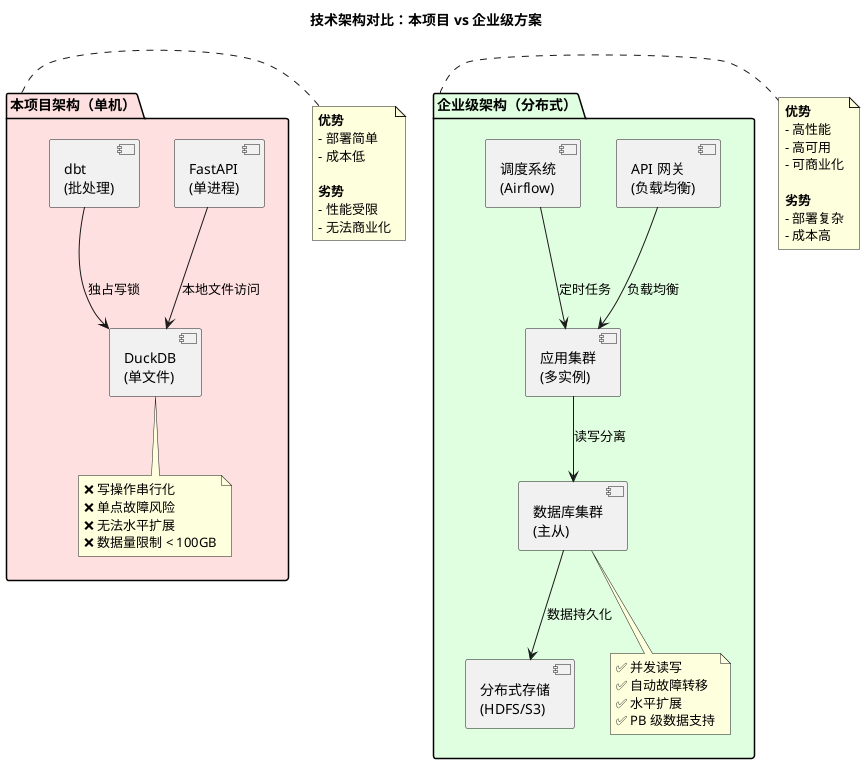
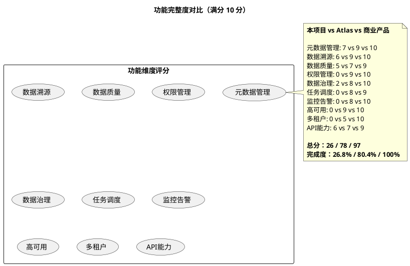
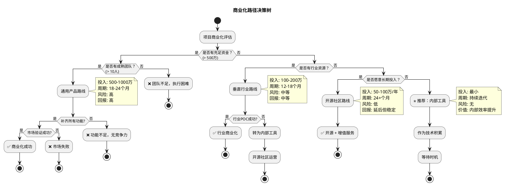
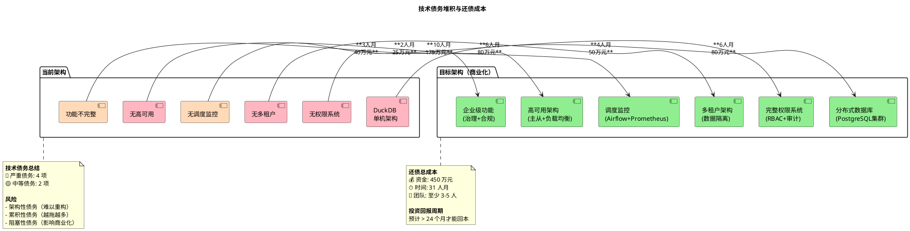
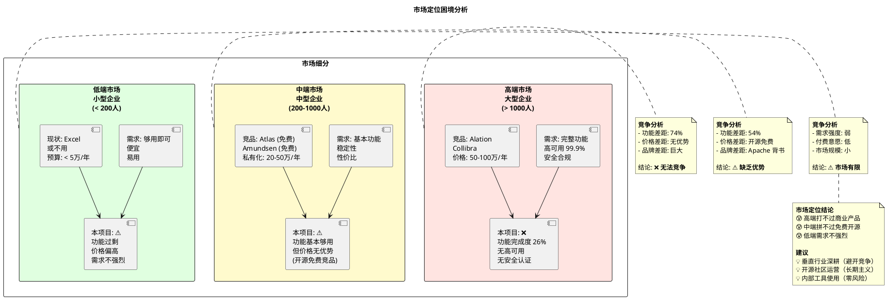
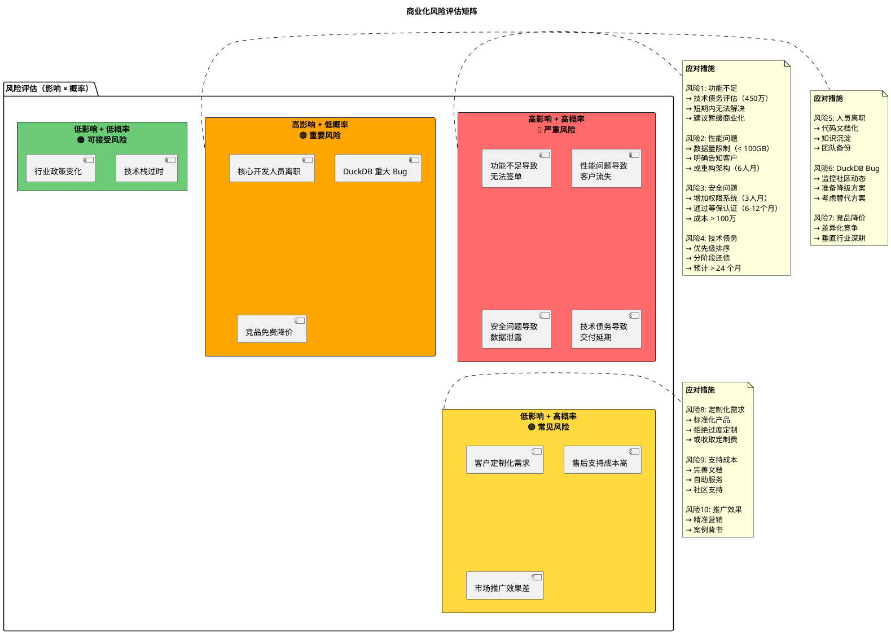
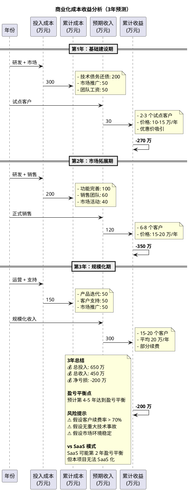
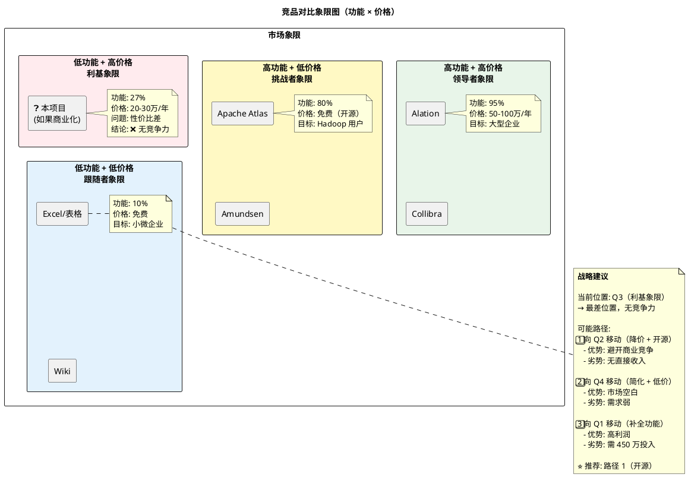

# 项目劣势分析 - PlantUML 可视化图表

## 图表目录

1. [技术架构瓶颈对比图](#1-技术架构瓶颈对比图)
2. [功能完整度对比雷达图](#2-功能完整度对比雷达图)
3. [并发性能瓶颈示意图](#3-并发性能瓶颈示意图)
4. [商业化路径决策树](#4-商业化路径决策树)
5. [技术债务堆积图](#5-技术债务堆积图)
6. [市场定位困境图](#6-市场定位困境图)
7. [风险评估矩阵图](#7-风险评估矩阵图)

---

## 1. 技术架构瓶颈对比图



---

## 2. 功能完整度对比雷达图



---

## 3. 并发性能瓶颈示意图

```plantuml
@startuml 并发性能瓶颈
!define RECTANGLE class
skinparam backgroundColor #FFFFFF
skinparam defaultFontName "Microsoft YaHei"

title DuckDB 并发写操作瓶颈示意图

participant "用户A\n(dbt run)" as UserA
participant "用户B\n(更新元数据)" as UserB
participant "用户C\n(查询报表)" as UserC
participant "DuckDB\n(单进程)" as DB

== 时间线 ==

UserA -> DB : 开始写操作（dbt run）
activate DB
note right of DB
  获取独占写锁
  预计耗时: 10 分钟
end note

UserB -> DB : 尝试写操作
DB --> UserB : ❌ 阻塞等待
note right of UserB
  被阻塞，直到用户A完成
  用户体验: 😡 极差
end note

UserC -> DB : 查询操作
DB --> UserC : ⚠️ 性能下降
note right of UserC
  读操作不阻塞，但性能差
  响应时间: 从 1s → 10s
end note

UserA -> DB : 写操作完成
deactivate DB

UserB -> DB : 开始写操作
activate DB
DB --> UserB : ✅ 成功
deactivate DB

note bottom of DB
  **问题总结**
  ❌ 写操作串行化（同时只能一个）
  ❌ 写操作期间读性能下降
  ❌ 无法支持多用户协作
  
  **vs 企业级数据库**
  ✅ 并发写（MVCC）
  ✅ 读写分离
  ✅ 性能稳定
end note

@enduml
```

---

## 4. 商业化路径决策树



---

## 5. 技术债务堆积图



---

## 6. 市场定位困境图



---

## 7. 风险评估矩阵图



---

## 8. 补充：成本收益分析图



---

## 9. 补充：竞品对比象限图



---

## 使用说明

### 如何查看这些图表

1. **在线查看**：
   - 访问 [PlantText](https://www.planttext.com/)
   - 复制对应的 PlantUML 代码
   - 粘贴到编辑器中即可渲染

2. **VS Code 查看**：
   - 安装插件：PlantUML
   - 安装 Java Runtime（PlantUML 依赖）
   - 安装 Graphviz（可选，渲染更好）
   - 右键 → Preview Current Diagram

3. **IDEA 查看**：
   - 安装插件：PlantUML Integration
   - 右键 → Show PlantUML Diagram

### 图表说明

| 图表 | 核心观点 | 适用场景 |
|------|---------|---------|
| **架构瓶颈对比** | 单机 vs 分布式差距巨大 | 技术评审 |
| **功能完整度雷达** | 完成度仅 26.8% | 产品规划 |
| **并发性能瓶颈** | DuckDB 写操作互斥 | 性能评估 |
| **商业化决策树** | 提供 4 种路径建议 | 战略决策 |
| **技术债务堆积** | 还债成本 450 万 | 预算规划 |
| **市场定位困境** | 高中低端市场都困难 | 市场分析 |
| **风险评估矩阵** | 识别严重风险 | 风险管理 |
| **成本收益分析** | 3 年亏损 200 万 | 财务预测 |
| **竞品象限图** | 处于最差象限 | 竞争分析 |

---

**文档版本：** v1.0  
**更新日期：** 2025-11-24  
**适用对象：** 技术决策者、产品经理、投资人
