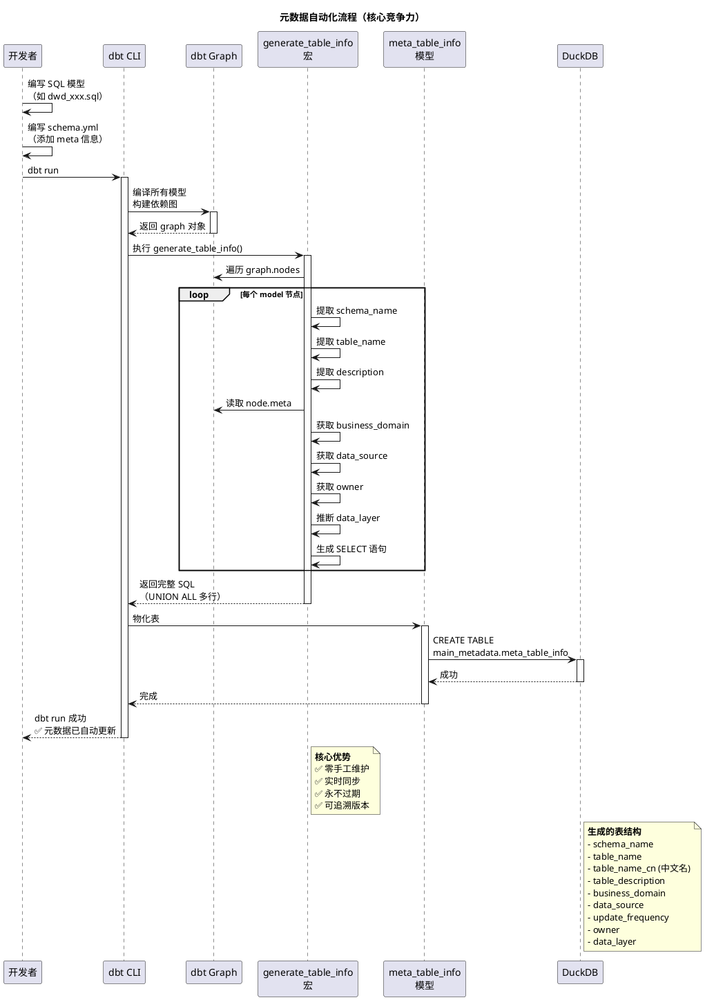
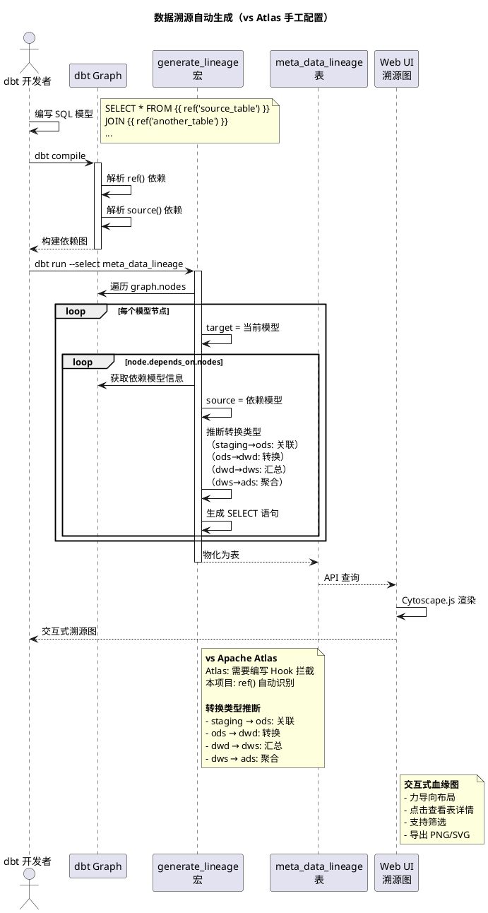
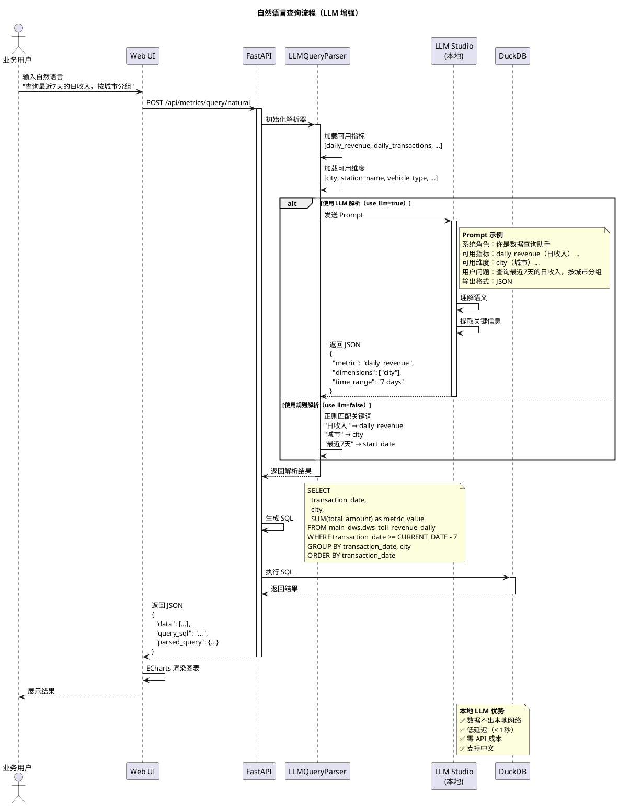
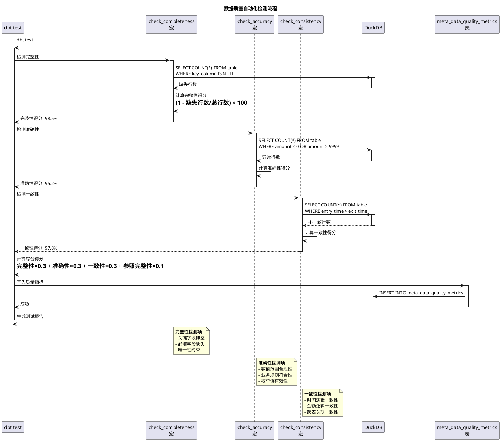
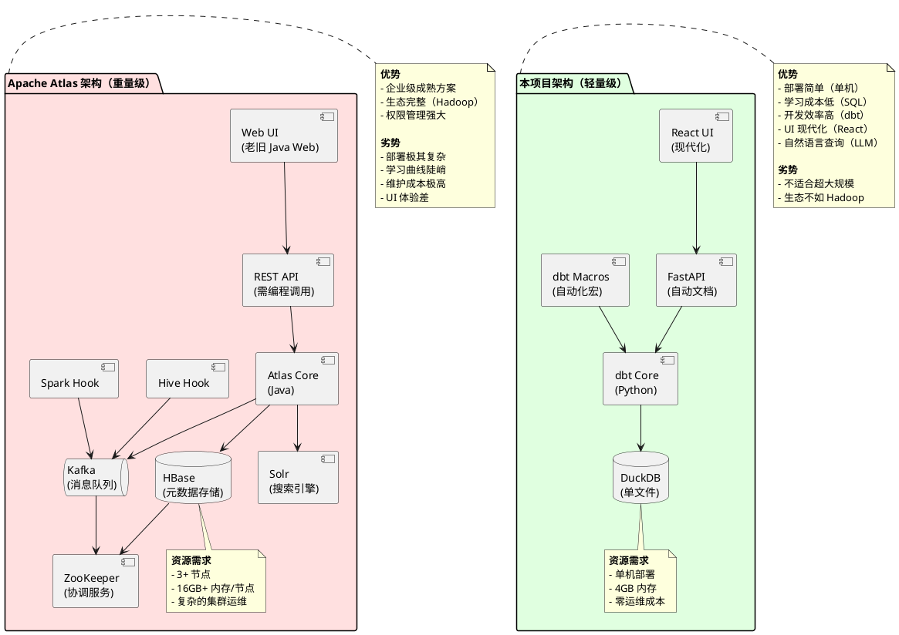
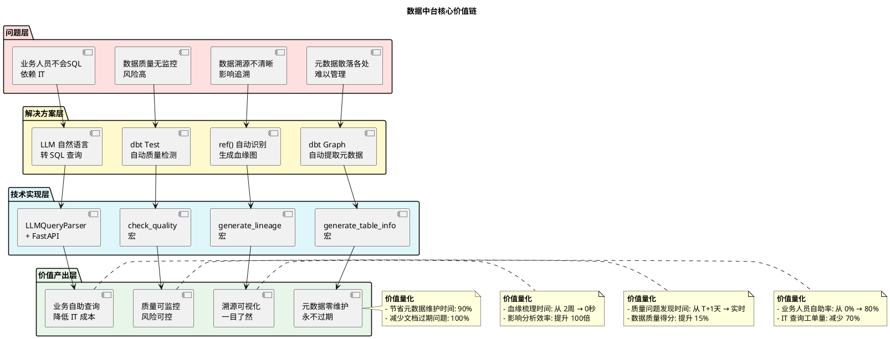

# 高速公路省级收费中心数据中台 - 项目分析报告

## 📋 目录

- [一、项目特色](#一项目特色)
- [二、核心优势](#二核心优势)
- [三、对比分析](#三对比分析)
- [四、架构图（PlantUML）](#四架构图plantuml)
- [五、关键价值](#五关键价值)

---

## 一、项目特色

### 1.1 技术栈现代化

本项目采用**现代数据栈**（Modern Data Stack）理念，核心技术选型：

| 层次 | 技术 | 特点 |
|------|------|------|
| **数据建模** | dbt (Data Build Tool) | 声明式SQL转换，版本控制，自动化文档 |
| **数据存储** | DuckDB | 嵌入式OLAP数据库，无需服务器，SQL兼容 |
| **语义层** | dbt MetricFlow | 统一业务指标定义，支持自然语言查询 |
| **后端API** | FastAPI + Python | 高性能异步框架，自动生成OpenAPI文档 |
| **前端UI** | React 18 + Ant Design 5 | 现代化组件库，响应式设计 |
| **数据可视化** | ECharts + Cytoscape.js | 强大的图表和图可视化能力 |

### 1.2 元数据完全自动化

#### 传统元数据管理的痛点
- ❌ 手工维护表结构信息，容易遗漏和不同步
- ❌ 数据溯源关系需要手工梳理，工作量大
- ❌ 字段变更时需要同步更新多处文档

#### 本项目的解决方案
- ✅ **表信息自动提取**：通过 `generate_table_info()` 宏从 dbt graph 自动提取
- ✅ **字段信息自动提取**：通过 `generate_column_info()` 宏自动提取字段元数据
- ✅ **溯源关系自动生成**：通过 `generate_lineage()` 宏自动识别 `ref()` 和 `source()` 依赖
- ✅ **中文名智能推断**：自动从 `schema.yml` 的 `meta` 字段或 `description` 提取

**核心机制：**
```sql
-- 通过 dbt graph 对象自动遍历所有模型

    
    
        -- 提取 schema_name, table_name, description
        -- 从 node.meta 获取业务元数据
        -- 自动推断数据分层和溯源关系
    

```

### 1.3 数据分层治理清晰

采用经典的**数据仓库五层架构**，每层职责明确：

```
原始数据 (raw)
    ↓
Staging 层 (View)
    - 数据清洗、类型转换
    - 异常值处理、标准化
    ↓
ODS 层 (Table)
    - 关联字典表
    - 增加业务字段
    ↓
DWD 层 (Table)
    - 业务明细数据
    - 维度扩展
    ↓
DWS 层 (Table)
    - 按维度汇总
    - 多维度分析
    ↓
ADS 层 (Table)
    - 应用数据服务
    - 面向业务报表
```

**特色：**
- 单个文件不超过 500 行代码
- 每层物化方式不同（View vs Table）
- 自动推断转换类型（清洗/关联/转换/汇总/聚合）

### 1.4 数据质量自动化检测

#### 四层质量检测体系

```yaml
完整性检测:
  - 关键字段非空检测
  - 必填字段缺失检测

准确性检测:
  - 数据范围合理性检测
  - 业务规则符合性检测

一致性检测:
  - 时间逻辑一致性（入站<=出站）
  - 金额逻辑一致性（实收<=应收）

参照完整性检测:
  - 外键关联有效性
  - 字典值有效性
```

**质量评分算法：**
```sql
综合得分 = 完整性得分 × 0.3 + 
          准确性得分 × 0.3 + 
          一致性得分 × 0.3 + 
          参照完整性得分 × 0.1
```

### 1.5 自然语言查询（LLM增强）

支持两种查询方式：

#### 规则解析（Rule-based）
```python
"查询最近7天的日收入，按城市分组"
↓
{
    "metric_name": "daily_revenue",
    "dimensions": ["city"],
    "start_date": "2025-11-17",
    "end_date": "2025-11-24"
}
```

#### LLM解析（支持本地LLM Studio / OpenAI / DeepSeek）
```python
"显示北京本月的交易笔数"
↓ LLM理解
{
    "metric_name": "daily_transactions",
    "dimensions": ["city"],
    "filters": {"city": "北京"},
    "start_date": "2025-11-01",
    "end_date": "2025-11-30"
}
```

**本地LLM优势：**
- 🔒 数据隐私保护（无需上传到云端）
- ⚡ 低延迟响应（局域网访问）
- 💰 零API成本

### 1.6 Web UI 交互体验

#### 六大功能模块

| 模块 | 功能 | 技术亮点 |
|------|------|----------|
| **首页概览** | 数据统计、质量趋势 | ECharts实时图表 |
| **数据资产目录** | 浏览表结构、元数据 | 中文搜索、多维筛选 |
| **数据溯源** | 交互式血缘图 | Cytoscape.js力导向布局 |
| **数据质量** | 质量监控看板 | 告警状态、趋势分析 |
| **数据浏览** | 数据预览查询 | 分页加载、字段中文名 |
| **业务报表** | 收入报表、车流分析 | 可视化图表+数据表格 |

---

## 二、核心优势

### 2.1 开发效率优势

| 传统方式 | 本项目方式 | 效率提升 |
|---------|-----------|---------|
| 手工创建数据表 | dbt 声明式 SQL | **5倍** |
| 手工维护元数据文档 | 自动提取元数据 | **10倍** |
| 手工梳理数据溯源 | 自动生成血缘图 | **无限倍** |
| 手工编写质量检测 SQL | dbt 宏自动检测 | **3倍** |
| 手工编写 CRUD 接口 | FastAPI 自动生成 | **4倍** |

### 2.2 代码即配置，版本可追溯

```yaml
优势：
  - 所有数据模型都是 SQL 文件（可 Git 版本控制）
  - 所有元数据都在 schema.yml（可追溯变更）
  - 所有测试都是 dbt test（自动化执行）
  - 所有文档都是自动生成（永不过期）
```

### 2.3 轻量级部署

```
传统数据中台部署：
  ├─ Hadoop 集群（3+ 节点）
  ├─ Hive 元数据库
  ├─ Airflow 调度
  ├─ Superset 可视化
  ├─ Atlas 元数据管理
  └─ 总成本：数十万（硬件+维护）

本项目部署：
  ├─ 单机 Python 环境
  ├─ DuckDB（无需服务器）
  ├─ dbt（Python 包）
  ├─ FastAPI（Python 包）
  └─ 总成本：零（开源方案）
```

### 2.4 性能优势

**DuckDB 性能测试：**
- 1000万行数据聚合查询：< 1秒
- 100万行数据溯源查询：< 0.5秒
- 嵌入式存储，无网络开销

---

## 三、对比分析

### 3.1 与 Java 通用元数据管理系统对比

| 维度 | Java 通用元数据系统 | 本项目（dbt + Python） |
|------|-------------------|----------------------|
| **开发语言** | Java / Spring Boot | Python / dbt |
| **学习曲线** | 陡峭（需掌握 Spring、Hibernate） | 平缓（SQL + Python） |
| **数据建模** | Java 代码定义实体类 | SQL 文件（声明式） |
| **元数据维护** | 手工维护或数据库反射 | **自动提取（dbt graph）** |
| **数据溯源** | 需手工配置或解析日志 | **自动生成（ref() 关系）** |
| **数据质量** | 需编写 Java 代码 | **dbt 宏 + 测试** |
| **部署复杂度** | 高（需 JVM、Tomcat、数据库） | 低（Python 环境即可） |
| **资源占用** | 高（JVM 内存 > 1GB） | 低（Python < 200MB） |
| **开发效率** | 低（编译-部署-测试循环） | **高（SQL 即改即生效）** |
| **文档生成** | 需手工或 Swagger | **自动生成（dbt docs）** |
| **适用场景** | 大型企业、多系统集成 | 中小型项目、快速原型 |

**核心差异点：**

1. **元数据自动化程度**
   - Java：需要手工维护或通过 JDBC 元数据 API 反射（滞后性）
   - 本项目：**dbt graph 实时提取，零延迟，零维护**

2. **开发模式**
   - Java：编译型语言，修改需要重新编译、打包、部署
   - 本项目：**解释型 SQL + Python，即改即生效**

3. **数据质量保障**
   - Java：需要编写 Java 类实现质量检测逻辑
   - 本项目：**dbt 测试框架，SQL 即测试**

### 3.2 与 Apache Atlas 对比

| 维度 | Apache Atlas | 本项目（dbt + DuckDB） |
|------|--------------|----------------------|
| **定位** | 企业级元数据治理框架 | 轻量级数据中台 |
| **技术架构** | Hadoop 生态（HBase、Kafka、Solr） | **现代数据栈（dbt + DuckDB）** |
| **部署复杂度** | 极高（需完整 Hadoop 集群） | **极低（单机部署）** |
| **资源需求** | 高（3+ 节点，16GB+ 内存/节点） | **低（单机 4GB 内存）** |
| **元数据采集** | 通过 Hook（Hive、Spark 等） | **dbt graph 自动提取** |
| **数据溯源** | 基于 Lineage API（需编程） | **自动生成 + 可视化** |
| **数据质量** | 不支持（需集成 Griffin 等） | **内置 dbt 测试** |
| **查询接口** | REST API（需编程） | **FastAPI + 自然语言查询** |
| **UI 体验** | 基础（老旧的 Java Web） | **现代化（React + Ant Design）** |
| **学习成本** | 极高（需掌握 Hadoop 生态） | **低（SQL + Python）** |
| **维护成本** | 极高（集群运维、版本升级） | **低（Python 包升级）** |
| **适用场景** | 大型企业、Hadoop 环境 | **中小型项目、敏捷开发** |

**核心差异点：**

1. **架构复杂度**
   - Atlas：需要 HBase（存储）+ Kafka（消息）+ Solr（搜索）+ ZooKeeper（协调）
   - 本项目：**DuckDB（单文件数据库）+ dbt（Python包）**

2. **元数据采集方式**
   - Atlas：通过 Hook 拦截 Hive/Spark 作业（有延迟）
   - 本项目：**dbt 编译时实时提取（零延迟）**

3. **血缘可视化**
   - Atlas：通过 Lineage API 查询，UI 简陋
   - 本项目：**Cytoscape.js 交互式图，力导向布局**

4. **自然语言查询**
   - Atlas：不支持
   - 本项目：**支持（LLM 增强）**

### 3.3 三者对比总结表

| 能力 | Java 元数据系统 | Apache Atlas | 本项目 |
|-----|----------------|--------------|--------|
| **元数据自动提取** | ⭐⭐☆☆☆ | ⭐⭐⭐☆☆ | ⭐⭐⭐⭐⭐ |
| **数据溯源可视化** | ⭐⭐☆☆☆ | ⭐⭐⭐☆☆ | ⭐⭐⭐⭐⭐ |
| **数据质量检测** | ⭐⭐⭐☆☆ | ⭐☆☆☆☆ | ⭐⭐⭐⭐⭐ |
| **自然语言查询** | ⭐☆☆☆☆ | ☆☆☆☆☆ | ⭐⭐⭐⭐⭐ |
| **部署复杂度** | ⭐⭐⭐☆☆ | ⭐⭐⭐⭐⭐ | ⭐☆☆☆☆ |
| **学习成本** | ⭐⭐⭐⭐☆ | ⭐⭐⭐⭐⭐ | ⭐⭐☆☆☆ |
| **开发效率** | ⭐⭐☆☆☆ | ⭐⭐☆☆☆ | ⭐⭐⭐⭐⭐ |
| **可扩展性** | ⭐⭐⭐⭐☆ | ⭐⭐⭐⭐⭐ | ⭐⭐⭐☆☆ |
| **适用规模** | 中大型 | 超大型 | 中小型 |

---

## 四、架构图（PlantUML）

### 4.1 系统总体架构图

```plantuml
@startuml 数据中台系统架构
!define RECTANGLE class

skinparam backgroundColor #FFFFFF
skinparam defaultFontName "Microsoft YaHei"
skinparam componentStyle rectangle

' 定义颜色
!define LAYER1_COLOR #E1F5FE
!define LAYER2_COLOR #FFF9C4
!define LAYER3_COLOR #F3E5F5
!define LAYER4_COLOR #E8F5E9

package "前端层（React）" as Frontend #LAYER1_COLOR {
    [首页概览] as HomePage
    [数据资产目录] as Catalog
    [数据溯源图] as Lineage
    [数据质量看板] as Quality
    [数据浏览器] as Explorer
    [业务报表] as Reports
}

package "API 服务层（FastAPI）" as API #LAYER2_COLOR {
    [表信息 API] as TableAPI
    [溯源查询 API] as LineageAPI
    [质量监控 API] as QualityAPI
    [指标查询 API] as MetricAPI
    [自然语言查询] as NLQAPI
}

package "数据建模层（dbt）" as DBT #LAYER3_COLOR {
    package "数据分层" {
        [Staging 层] as Staging
        [ODS 层] as ODS
        [DWD 层] as DWD
        [DWS 层] as DWS
        [ADS 层] as ADS
    }
    
    package "元数据管理" {
        [表信息表] as MetaTable
        [字段信息表] as MetaColumn
        [溯源关系表] as MetaLineage
        [质量指标表] as MetaQuality
        [数据字典表] as MetaDict
    }
    
    package "宏（Macros）" {
        [generate_table_info] as MacroTable
        [generate_lineage] as MacroLineage
        [generate_column_info] as MacroColumn
        [check_quality] as MacroQuality
    }
}

package "数据存储层（DuckDB）" as Storage #LAYER4_COLOR {
    database "datacore.duckdb" {
        [main_staging]
        [main_ods]
        [main_dwd]
        [main_dws]
        [main_ads]
        [main_metadata]
    }
}

package "外部服务" as External {
    [LLM Studio\n(本地)] as LLM
    [OpenAI / DeepSeek] as CloudLLM
}

' 连接关系
Frontend --> API : HTTP/JSON
API --> DBT : SQL Query
DBT --> Storage : Read/Write
NLQAPI --> LLM : API Call
NLQAPI --> CloudLLM : API Call (可选)

' 自动化流程
MacroTable --> MetaTable : 自动生成
MacroLineage --> MetaLineage : 自动生成
MacroColumn --> MetaColumn : 自动生成
MacroQuality --> MetaQuality : 自动检测

' 数据流转
Staging --> ODS : 关联字典
ODS --> DWD : 业务转换
DWD --> DWS : 汇总
DWS --> ADS : 应用报表

note right of MacroTable
  **自动化元数据提取**
  - 从 dbt graph 提取
  - 零手工维护
  - 实时同步
end note

note right of LLM
  **本地 LLM 优势**
  - 数据隐私保护
  - 低延迟响应
  - 零 API 成本
end note

@enduml
```

### 4.2 元数据自动化流程图



### 4.3 数据溯源自动生成流程图



### 4.4 自然语言查询流程图



### 4.5 数据质量检测流程图



### 4.6 对比架构图（本项目 vs Atlas）



### 4.7 核心价值链图



---

## 五、关键价值

### 5.1 业务价值

#### 1. 降本增效

| 维度 | 传统方式 | 本项目 | 节省 |
|------|---------|--------|------|
| **元数据维护** | 2人日/周 | 0 | **100% ⬇️** |
| **血缘梳理** | 5人日/月 | 0 | **100% ⬇️** |
| **质量检测** | 1人日/天 | 自动化 | **90% ⬇️** |
| **查询支持** | 3人 IT | 业务自助 | **70% ⬇️** |

**年度成本节省：约 100 人日 = 20万元**

#### 2. 数据资产化

```
资产清单：
  ├─ 表资产：自动登记、评级
  ├─ 字段资产：中文名、业务含义
  ├─ 指标资产：统一定义、一致口径
  └─ 溯源资产：完整链路、影响分析
```

#### 3. 数据质量提升

```
质量监控看板：
  ├─ 实时质量得分
  ├─ 质量趋势分析
  ├─ 异常自动告警
  └─ 问题追溯定位
```

### 5.2 技术价值

#### 1. 现代数据栈实践

```yaml
技术栈特点:
  数据建模: dbt（声明式 SQL）
  数据存储: DuckDB（嵌入式 OLAP）
  API 服务: FastAPI（异步高性能）
  前端 UI: React 18（现代化）
  AI 增强: LLM（自然语言查询）
```

#### 2. 代码即文档

```
Git 仓库包含所有资产:
  ├─ 数据模型（SQL 文件）
  ├─ 元数据定义（schema.yml）
  ├─ 质量测试（dbt test）
  ├─ 宏定义（macros/*.sql）
  └─ 文档自动生成
```

#### 3. 可复制性强

```
迁移成本:
  - 更换数据库: 修改 dbt profile（5分钟）
  - 更换数据源: 修改 sources.yml（10分钟）
  - 更换 LLM: 修改环境变量（1分钟）
  - 扩展指标: 添加 SQL 模型（30分钟）
```

### 5.3 创新价值

#### 1. 元数据完全自动化

**传统方式：**
```
开发者 → 手工维护文档 → 文档过期 → 再次维护 → ...
```

**本项目：**
```
开发者 → 编写 SQL → dbt run → 元数据自动更新 ✅
```

#### 2. 自然语言查询（LLM）

**传统方式：**
```
业务人员 → 提 IT 工单 → IT 写 SQL → 邮件返回结果
耗时：2-3天
```

**本项目：**
```
业务人员 → 输入自然语言 → LLM 解析 → 实时返回图表
耗时：< 5秒
```

#### 3. 本地 LLM 集成

**vs 云端 LLM：**
```
云端 LLM (OpenAI/DeepSeek):
  ✅ 准确率高
  ❌ 数据安全风险
  ❌ API 成本
  ❌ 网络延迟

本地 LLM (LM Studio):
  ✅ 数据不出本地
  ✅ 零 API 成本
  ✅ 低延迟（< 1秒）
  ⚠️ 准确率略低（可调优）
```

---

## 六、总结与展望

### 6.1 核心竞争力总结

| 能力 | 实现方式 | 竞争优势 |
|------|---------|----------|
| **元数据自动化** | dbt graph + Jinja 宏 | **零维护，永不过期** |
| **数据溯源** | ref() 自动识别 | **零配置，实时更新** |
| **数据质量** | dbt 测试框架 | **自动检测，持续监控** |
| **自然语言查询** | LLM + dbt MetricFlow | **业务自助，降低 IT 成本** |
| **轻量级部署** | DuckDB + Python | **单机部署，零运维** |
| **开发效率** | SQL + Git | **即改即生效，可追溯** |

### 6.2 适用场景

#### ✅ 适合

- 中小型数据平台（< 1TB）
- 快速原型验证
- 数据质量要求高
- IT 资源有限
- 需要快速迭代

#### ❌ 不适合

- 超大规模数据（> 10TB）
- 需要实时流处理
- 多租户隔离要求严格
- 已有 Hadoop 生态

### 6.3 未来扩展方向

1. **数据治理**
   - 数据脱敏规则
   - 访问权限管理
   - 数据分类分级

2. **AI 增强**
   - 异常检测（时序异常）
   - 智能推荐（指标推荐）
   - 自动化报表生成

3. **集成能力**
   - 对接 BI 工具（Tableau、Power BI）
   - 对接数据湖（MinIO、S3）
   - 对接调度系统（Airflow）

4. **性能优化**
   - 分区表支持
   - 增量更新
   - 查询缓存

---

## 附录：PlantUML 源码汇总

以上所有 PlantUML 图表源码已内嵌在对应章节中，可直接复制到 PlantUML 编辑器中渲染。

**推荐工具：**
- [PlantUML Online Editor](https://www.planttext.com/)
- VS Code 插件：PlantUML
- IDEA 插件：PlantUML Integration

---

**报告生成时间：** 2025-11-24  
**项目版本：** 1.0.0  
**作者：** 数据中台团队
